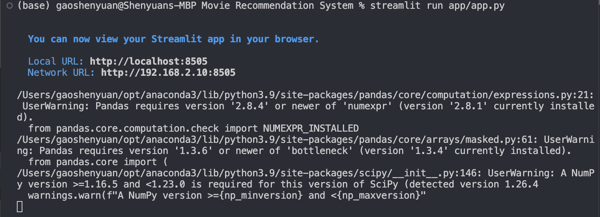
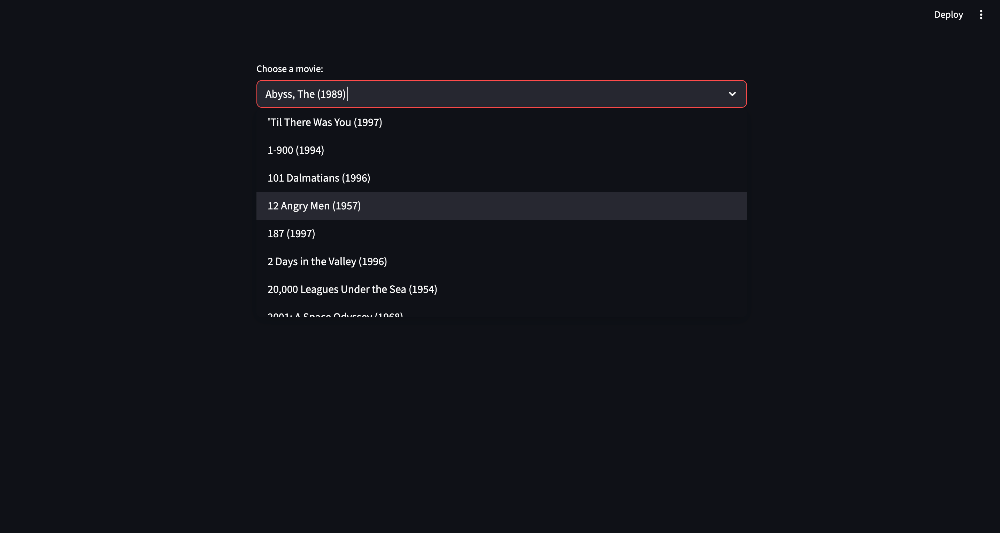
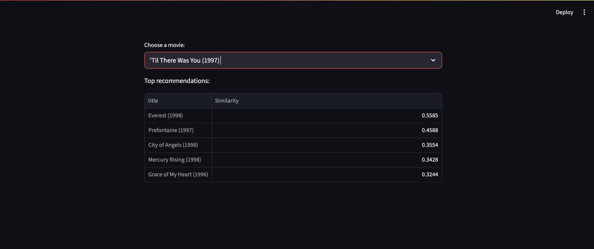

# 🎬 Movie Recommendation System

A simple movie recommendation engine using the MovieLens dataset. Built with Python, Pandas, Scikit-learn, and Streamlit.

## Features
- Cosine similarity-based recommendations
- Interactive Streamlit app
- Uses MovieLens 100k dataset

## How to Run
In the terminal from the project root folder, run:

streamlit run app/app.py

Choose a movie:

Find the Top recommendations:

**Made with ❤️ by [Shenyuan Gao](https://github.com/gaoshenyuan)**

