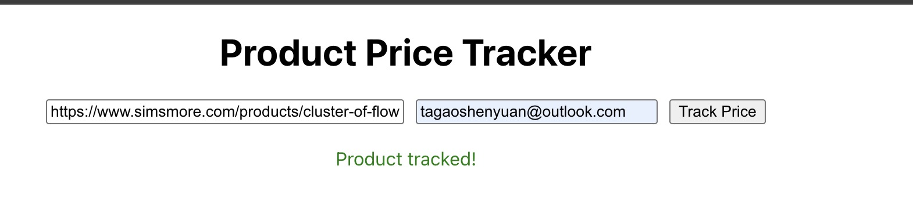
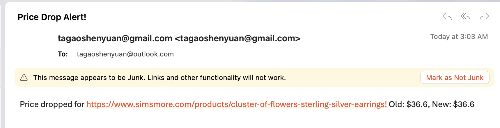

# Product Price Tracker

A full-stack web application that lets users track the price of products from various e-commerce sites and receive instant email notifications when a product is successfully tracked.

## Features

- **Track product prices** from supported e-commerce sites



- **Instant email confirmation** when a product is successfully tracked


- **Automatic price history** storage and display
- **Modern React frontend** with a simple UI
- **FastAPI backend** with PostgreSQL database

## Tech Stack
- **Frontend:** React (with proxy for API requests)
- **Backend:** FastAPI (Python)
- **Database:** PostgreSQL
- **Scraping:** Requests + BeautifulSoup
- **Email:** SMTP (Gmail supported via App Password)

## Setup Instructions

### 1. Clone the Repository
```bash
git clone <repo-url>
cd Price\ Tracker
```

### 2. Backend Setup
- Go to the backend directory:
  ```bash
  cd backend
  ```
- Install dependencies:
  ```bash
  pip install -r requirements.txt
  ```
- Create a `.env` file (see `.env.example`) with your PostgreSQL and email SMTP credentials.
- Run the backend server:
  ```bash
  uvicorn main:app --reload
  ```

### 3. Frontend Setup
- Go to the frontend directory:
  ```bash
  cd ../frontend
  ```
- Install dependencies:
  ```bash
  npm install
  ```
- Start the React development server:
  ```bash
  npm start
  ```
- The frontend will proxy API requests to the backend (see `setupProxy.js`).

## Email Configuration (Gmail Example)
- Enable 2-Step Verification on your Google account.
- Generate an App Password for your app ([instructions](https://support.google.com/accounts/answer/185833?hl=en)).
- Add your email and app password to your `.env`:
  ```
  SMTP_SERVER=smtp.gmail.com
  SMTP_PORT=587
  SMTP_USER=your_email@gmail.com
  SMTP_PASS=your_app_password
  ```

## Usage
1. Open the frontend (usually at http://localhost:3000).
2. Enter a product URL and your email.
3. Click "Track Price".
4. If successful, you will receive a confirmation email and see the price history.

## Limitations
- **This web app only supports small e-commerce sites.** Most major e-commerce sites (such as Amazon, BestBuy, Walmart, etc.) have strong anti-bot protections and are not supported by this tracker.
- The app works best for smaller, less-protected online stores, or those that display prices using Open Graph meta tags.
- For robust tracking of major sites, consider integrating a third-party price API.


**Made with ❤️ by [Shenyuan Gao](https://github.com/gaoshenyuan)**
